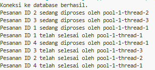

**Multithreaded Order Processor**
📘 Deskripsi
Program ini adalah simulasi sistem pemrosesan pesanan secara paralel (multithreading) menggunakan bahasa Java dan database MySQL.
Tujuan utamanya adalah untuk memperlihatkan bagaimana beberapa pesanan dapat diproses secara bersamaan oleh beberapa thread, dengan pembaruan status di database.
Program terdiri dari dua bagian utama:
'MultithreadedOrderProcessor' → kelas utama yang mengambil data pesanan dari database dan mengatur thread pool.
'OrderProcessor' → kelas worker yang dijalankan oleh tiap thread untuk memperbarui status pesanan di database.
**⚙️ Fitur Utama**
Mengambil data pesanan dengan status "Menunggu" dari tabel orders
Memproses beberapa pesanan secara multithreaded dengan ExecutorService.
Setiap thread akan:
1. Mengubah status pesanan dari "Menunggu" → "Diproses" → "Selesai"
2. Menjalankan simulasi waktu proses (2–4 detik) agar terlihat realistis.
3. Menggunakan koneksi database terpisah untuk setiap thread agar lebih aman dan menghindari konflik.
**Penjelasan Alur Program**
Program membuat koneksi awal ke database untuk mengambil daftar pesanan berstatus “Menunggu”.
Untuk setiap pesanan, dibuat sebuah thread baru (OrderProcessor) menggunakan ExecutorService dengan 3 worker thread.
Setiap thread:
Membuka koneksi MySQL sendiri.
Mengubah status pesanan menjadi "Diproses".
Menunggu 2–4 detik (simulasi waktu kerja).
Mengubah status menjadi "Selesai".
Program berakhir setelah semua thread menyelesaikan pekerjaannya.
**🧱 Teknologi yang Digunakan**
Java JDK 17
MySQL 8+
JDBC (Java Database Connectivity)
ExecutorService & Thread Pool
**Contoh Output**
1. 